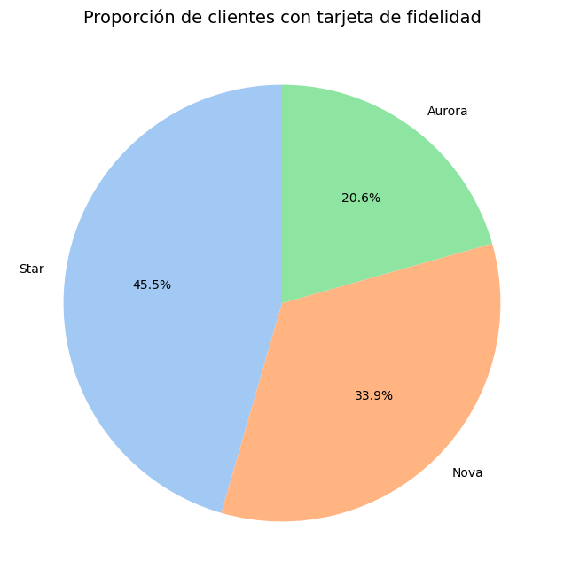
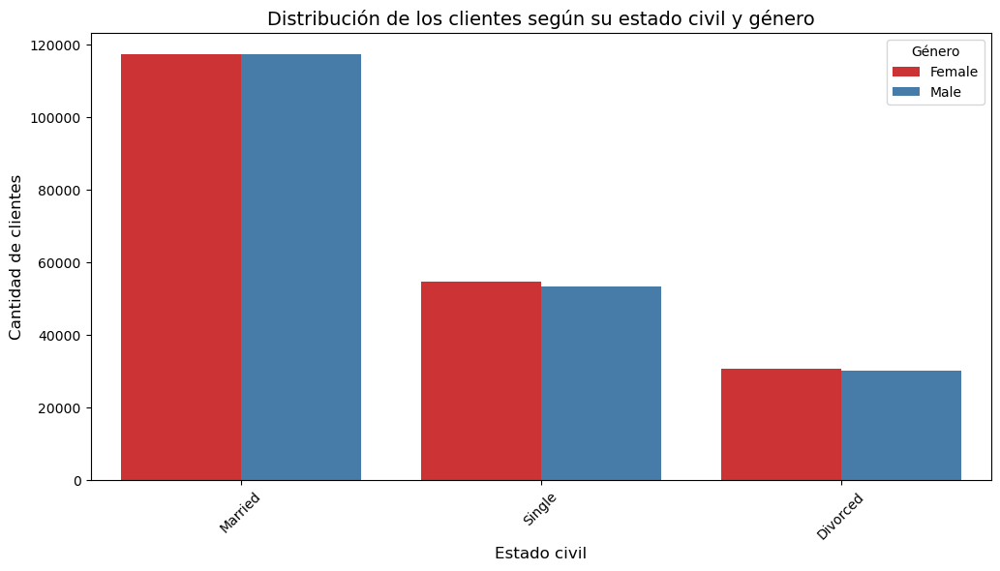

# Informe de Conclusiones del Ejercicio de Evaluación Final

## Introducción
El ejercicio consistió en analizar dos datasets proporcionados por una aerolínea: **Customer Flight Activity** (actividad de vuelos) y **Customer Loyalty History** (historial de lealtad). El objetivo principal fue realizar un análisis completo, desde la exploración inicial hasta la visualización y evaluación estadística, para obtener información clave sobre los clientes y su comportamiento en el programa de lealtad.

## Exploración y Limpieza de Datos

### Observaciones Iniciales
- **Valores Nulos:**
  - En el dataset de lealtad, la columna `salary` presentaba valores nulos, los cuales fueron rellenados con la media para mantener la consistencia.
  - Otras columnas relevantes, como `distance` y `points_accumulated`, no presentaron problemas significativos de valores faltantes.

- **Tipos de Datos:**
  - Los nombres de las columnas fueron estandarizados (convertidos a minúsculas y sin espacios) para facilitar el manejo.
  - Se ajustaron los tipos de datos según su naturaleza (números, categóricos, fechas).

### Unión de Datasets
- La unión de los datasets se realizó usando el campo `loyalty_number` como clave primaria. Esto permitió combinar los datos de actividad de vuelos con los datos demográficos y de lealtad de los clientes.

## Análisis de Visualización

1. **Distribución de Vuelos Reservados por Mes:**
   - Se observó que la cantidad de vuelos reservados varió significativamente según el mes, con picos en periodos vacacionales.
   - Gráficos de barras mostraron claramente estas tendencias temporales.

      
      

2. **Relación entre Distancia y Puntos Acumulados:**
   - Un gráfico de dispersión reveló una relación positiva: a mayor distancia volada, mayor cantidad de puntos acumulados.
   - Algunos puntos atípicos indicaron posibles clientes con beneficios especiales o vuelos excepcionales.
   
   

3. **Distribución de Clientes por Provincia:**
   - Los clientes estaban distribuidos principalmente en provincias con grandes centros urbanos.
   - Gráficos de barras destacaron las provincias con mayor cantidad de clientes.

   

4. **Salario Promedio por Nivel Educativo:**
   - Los clientes con niveles educativos más altos (como maestrías o doctorados) tendieron a tener salarios promedio mayores.
   - Un gráfico de barras permitió comparar claramente los diferentes grupos educativos.
   
   

5. **Proporción de Tipos de Tarjetas de Lealtad:**
   - Los clientes con tarjetas de tipo “Star” fueron la mayoría.
      
   

6. **Distribución de Clientes por Estado Civil y Género:**
   - Los clientes casados y solteros representaron la mayor parte de la base de datos.
   - Un gráfico de barras agrupadas permitió comparar las distribuciones por estado civil y género.
      

## Evaluación Estadística: Diferencias en Vuelos por Nivel Educativo

### Resultados Clave:
1. **Análisis Descriptivo:**
   - Se calculó el promedio de vuelos reservados por clientes según su nivel educativo.
   - Las diferencias en el promedio fueron notables, especialmente entre clientes con niveles educativos básicos y avanzados.

2. **Prueba de Hipótesis:**
   - Se aplicó la prueba de Kruskal-Wallis debido a que los datos no seguían una distribución normal.
   - Resultado: El p-valor obtenido fue menor que 0.05, lo que indica diferencias significativas en el número de vuelos reservados entre niveles educativos.

3. **Conclusión:**
   - Clientes con niveles educativos más altos parecen reservar más vuelos en promedio, lo que podría estar relacionado con mayores ingresos o necesidades laborales.

## Conclusiones Generales
- Los datos muestran una clara relación entre la distancia volada y los puntos acumulados, confirmando la eficacia del programa de lealtad basado en distancia.
- La distribución de clientes por provincia destaca la importancia de las áreas urbanas para la aerolínea.
- Los clientes con niveles educativos y salarios más altos representan un segmento valioso con mayor actividad en vuelos.
- Existen diferencias estadísticamente significativas en la actividad de vuelos según el nivel educativo, lo que podría guiar estrategias de marketing más segmentadas.

## Recomendaciones
1. **Segmentación del Programa de Lealtad:**
   - Diseñar beneficios adicionales para clientes con altos niveles educativos o mayores ingresos.

2. **Foco en Provincias Urbanas:**
   - Incrementar la presencia y promociones en las provincias con mayor cantidad de clientes.

3. **Análisis Continuo:**
   - Realizar evaluaciones periódicas para identificar cambios en las tendencias de clientes y ajustar las estrategias del programa de lealtad.

4. **Gestíon de Outliers:**
   - Investigar a los clientes con comportamientos atípicos para entender mejor sus necesidades o corregir posibles errores en los datos.

